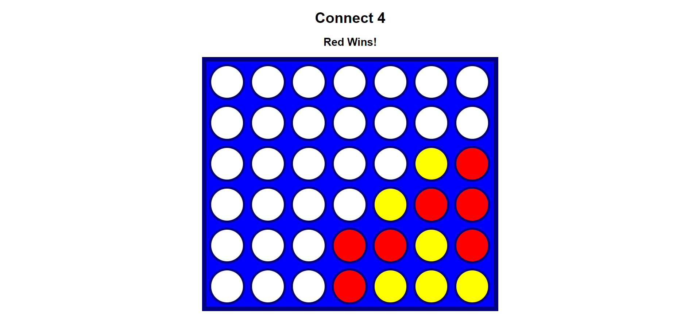

# Connect 4 Game
Connect 4 is a two-player connection game in which the players take turns dropping colored discs from the top into a vertically suspended grid. The grid has six rows and seven columns. The objective of the game is to be the first to form a horizontal, vertical, or diagonal line of four of one's own discs.
## Features
-Interactive game board with a visually appealing interface.
-Two-player mode for competitive gameplay.
-Game logic to manage turns, detect wins, and handle draws.
-Automatic win detection and highlight of the winning combination.

<li><u>Screenshot</u>
  <ul></ul>
</li>
